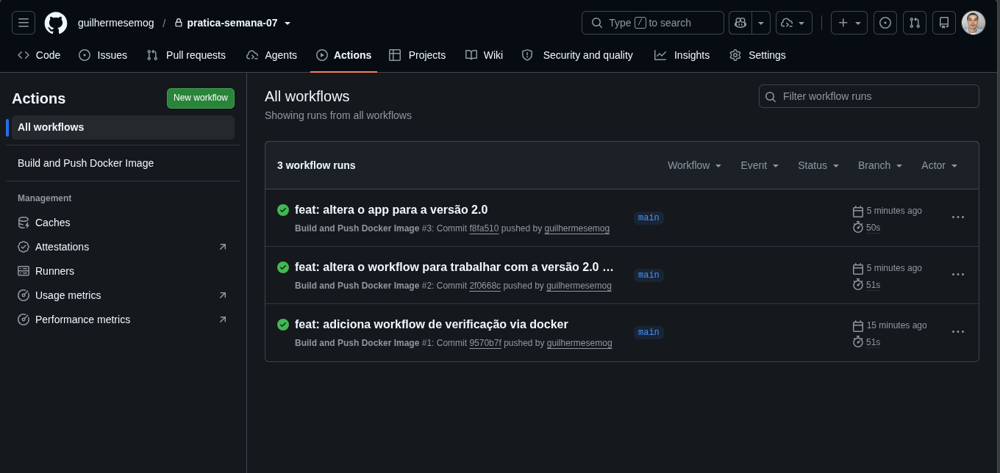
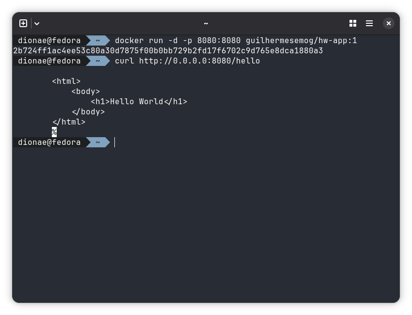
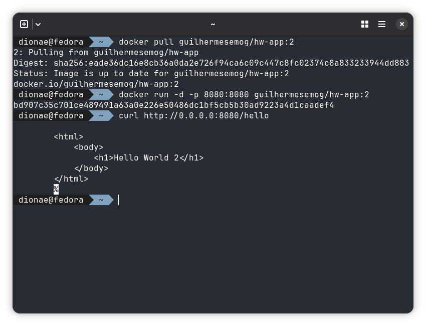

# Aplicacao Hello World com Docker e GitHub Actions

## Entrega e avaliacao

Este repositorio demonstra o fluxo completo de uma aplicacao conteinerizada:

`codigo -> Dockerfile -> build -> execucao local -> GitHub -> GitHub Actions -> Container Registry -> download -> execucao local`

## Entregaveis

1. **Repositorio GitHub:** https://github.com/guilhermesemog/pratica-semana-07/
2. **Dockerfile:** [Dockerfile](Dockerfile), utilizado para criar a imagem Docker.
3. **Pipeline do GitHub Actions:** [docker.yml](.github/workflows/docker.yml), executada automaticamente a cada `push` na branch `main`.
4. **Evidencias das execucoes da pipeline:** 
5. **Imagem no Container Registry:** `guilhermesemog/hw-app:1.0` e `guilhermesemog/hw-app:2.0` no Docker Hub.
6. **Evidencias das versoes:** https://hub.docker.com/repository/docker/guilhermesemog/hw-app/general
7. **Evidencias da execucao local:**  
## Aplicacao

A aplicacao utiliza FastAPI e disponibiliza o endpoint:

```text
GET http://localhost:8080/hello
```

Resposta da versao 1.0:

```text
Hello World
```

Resposta da versao 2.0:

```text
Hello World 2
```